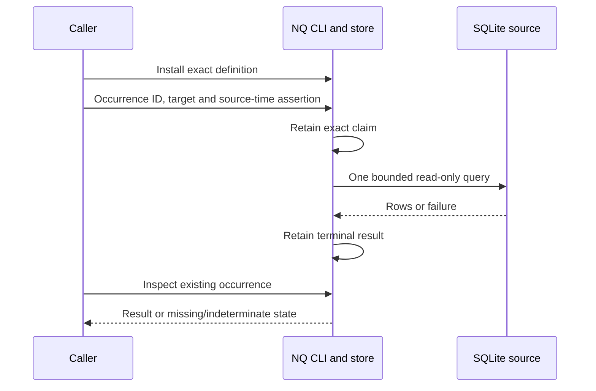

# Check a local source and keep the result

Use saved checks when you already have a SQLite observation source and want to
retain one bounded check result. You do not need a model, daemon or full
Constellation deployment for this local read.

This is an experimental local capability, not a complete recurring monitoring
profile. A successful query does not establish legitimate reliance on its source.

## Run the disposable example

Public prerequisites: this repository, Rust 1.94.0/Cargo, a C compiler for bundled
SQLite, Python 3.10 or newer, and Linux. No private source, credentials or background
services are required. Rust dependency downloads use the committed Cargo.lock.

```sh
git clone https://github.com/unpingable/constellation-nq.git
cd constellation-nq
# For repeatable deployment, check out the exact public revision you selected.
cargo build --locked -p nq-app --bin nq
python3 examples/saved-check-local.py \
  --nq "$PWD/target/debug/nq" \
  --root /tmp/nq-saved-check-cli-001-example
```

The root must not already exist. Use the `/tmp` location shown, or a parent
directory owned by the operator and protected from replacement by other users
or groups (for example, a newly created mode `0700` work directory). A
group-writable checkout or custom container mount may be refused by NQ's
helper-runtime directory checks. Do not relax that check or change permissions
on someone else's directory to make the example pass.

The example creates only its own NQ store and
SQLite source, then checks exact-install replay, result inspection, duplicate
evaluation after source change/removal, stale/future observation refusal, and
maintenance coverage/overrun. Success prints `"result": "qualified"` with the
retained transcript location. No message, provider or production action occurs.

Verified public source: `ad7dd887b52269c6e8c9dd7ffd10829861de4596`, Linux x86-64,
Rust/Cargo 1.94.0. An anonymous HTTPS clone built with an empty target directory
and public registry dependencies; the example then passed in a separate
network-isolated filesystem view with no private repository or home-directory
access. The first example invocation refused a group-writable parent before
initialization; a fresh protected directory passed using that same built
executable. This qualifies the local check and its failure/replay cases, not
a recurring or multi-component profile.

The central caller boundary uses actual supported commands:

```sh
nq --config ./nq.toml --json saved-check install --definition ./check.json
nq --config ./nq.toml --json saved-check inspect capacity
nq --config ./nq.toml --json saved-check evaluate capacity \
  --evaluation-id check-001 --target /absolute/path/source.sqlite \
  --source-observed-at 2026-09-14T00:00:00Z
nq --config ./nq.toml --json saved-check result --evaluation-id check-001
```

Those four commands illustrate adaptation; use the complete example for working
configuration and inputs. Its date is intentionally supplied by the caller:
substitute a real source observation, not the current time merely to pass freshness.



## What the result means

Definitions use `nq.saved-check-definition/v1`. `non_empty` fails if any rows
exist; `empty` fails if no rows exist; `threshold` fails if a named finite numeric
column exceeds its threshold. A refused query is not a failed predicate. SQL
errors, unsupported statements, stale source assertions, invalid result shapes
and exceeded limits yield explicit refusals.

The caller owns collection, source identity and source observation time. NQ
records `source_observed_at_assertion` separately from `read_attempted_at`.
Neither a file's modification time nor a successful read proves current contents
or upstream provenance. New observations use new occurrence IDs; they do not
rewrite old results or permanently change an installed definition's freshness.

Exact duplicate requests reopen the existing occurrence without reading the
source, even after the source disappears. Changed definition/target/time material
under the same occurrence ID refuses. A claim without a terminal result remains
indeterminate; inspect it before considering another occurrence. No automatic
claim reclamation, retry or inferred success exists.

Limits include 1,024 rows, 256 KiB aggregate returned values and per-value limits,
a 2-second SQLite progress deadline and bounded lock waits. These are not a hard
wall-clock guarantee for a stalled filesystem; use bounded process supervision
where a whole-command deadline is necessary.

## Project a retained result into a caller condition

This command and the extended local example are qualified at source
`a0d6bb8af44bed66183036e227fa2d2c5e1c87cb`. The focused gate passed 102
application unit tests, including absent/malformed read evidence and historical
maintenance controls, plus the actual CLI example. Public source
`b4487cbb44d4046be2a852963ca1f08592d9cb05` (same runtime, added documentation)
was then cloned anonymously, built with an empty target and public dependencies,
and ran this extended example in a network-isolated environment with no private
repository or home-directory mounts. Linux x86-64 and Rust/Cargo 1.94.0 were
used. Its matching source and example must be used together. This reproduction
still does not establish a recurring monitoring or full consumer profile.

An attention or scheduling integration can read a retained result without
rereading its SQLite source:

```sh
nq --config ./nq.toml --json saved-check condition \
  --evaluation-id check-001 \
  --component queue --kind backlog --subject local \
  --at 2026-09-14T00:00:30Z
```

The output is `nq.saved-check-condition/v1`. It binds the evaluation ID and
retained definition digest to the original outcome and source-time assertion,
then records the caller's component/kind/subject/time mapping separately. Its
`source_assertion.state` is `fresh`, `stale`, or `future` only relative to the
caller-provided `--at`; it is not a read of present source state. A missing or
invalid retained result refuses explicitly. A claimed evaluation remains
indeterminate. A refused source or SQL evaluation remains a refusal rather than
a false predicate result.

For a retained `passed` or `failed` result, the projection also requires and
returns its `read_attempt` time as retained local-read evidence. That evidence
is distinct from the caller's source-observation assertion and does not establish
upstream currentness. Missing or malformed local-read evidence refuses. If `--at`
precedes the retained read attempt, the projection is `indeterminate` with
`read_attempt.state: not_yet_observed`, rather than presenting a later result as
available history.

The projection also returns a maintenance annotation: `covered`, `overrun`,
`uncovered`, or `unavailable`. Coverage never changes a failed result, hides a
refusal, grants permission, or suppresses attention. The mapping is caller-owned;
NQ does not schedule it, submit it to Nightshift, or decide whether a person
needs attention. The command makes no source-target reads. Current Store helpers
do not expose one explicit cross-table SQLite read snapshot, so concurrent
writes can make the retained evaluation and maintenance view a closely timed,
but not atomic, read view.

For a historical projection, declarations retained after `--at` are excluded.
That prevents a later record from retrospectively covering or overrunning an
earlier condition. Invalid retained declaration material yields `unavailable`,
not `uncovered`.

## Maintenance and lifecycle

`maintenance declare` accepts `nq.maintenance-declaration/v1`: a future increasing
UTC window, exact component/kind, optional subject pattern and operator identity.
An exact duplicate reopens the original declaration; changed material refuses.
There are no update, cancel, clear or extend verbs.

`maintenance inspect --component NAME --kind KIND --subject SUBJECT --at TIME`
returns covered, overrun or uncovered for that caller-supplied condition and time.
Invalid retained declarations refuse instead of fabricating uncovered state.
Coverage never removes the condition, proves resolution or grants permission.
An attention owner must use this annotation before deciding whether to interrupt
a person; declaring maintenance does not by itself suppress a notification.

Normal operation retains the NQ database, configuration, definitions and source
observation references. Stop the invoking scheduler before an upgrade/backup and
use [NQ's backup, doctor and explicit upgrade procedures](OPERATIONS.md), not a
raw copy omitting SQLite WAL state. The public v5→v12 upgrade verifies a separate
backup and adds empty custody tables; it does not synthesize historical checks.
Versions 6–11 belong to a separate development schema line and are not accepted
by this migration. They must retain their matching verifier and recovery tools;
changing a version number is not migration. Downgrade and in-place rollback are
not advertised.

The example retains state for investigation. Only after inspecting its result,
remove the exact disposable example directory if no longer needed. Do not apply
tutorial cleanup to user records. If interrupted, inspect the recorded occurrence
with `saved-check result` first; stopping a process does not complete its work.

Recurring Monitor/NQ/Nightshift admission and attention binding remain incomplete.
This local example does not qualify legacy monitoring retirement, live delivery,
federation or the full multi-component integration profile.
